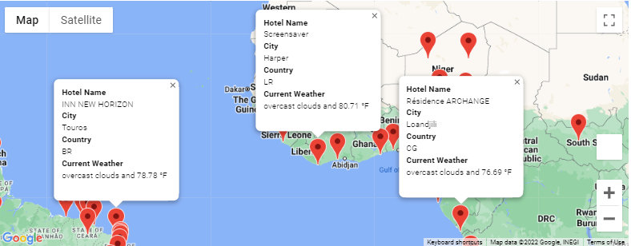
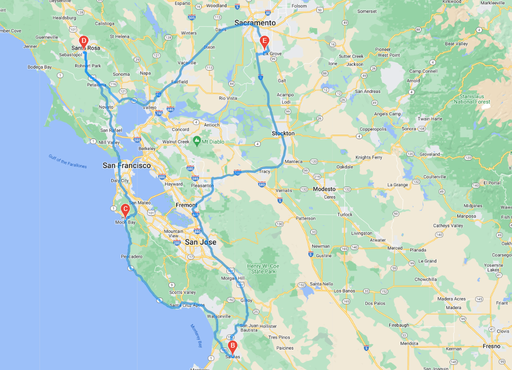
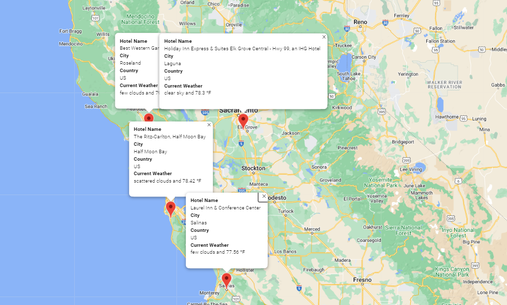

# World_Weather_Analysis_Challenge

## Overview 

This project has been undertaken on behalf of PlanMyTrip, a travel technology company that specializes in Internet related services in the hotel and lodging industry. We have used Python libraries like Pandas, Numpy, Matplotlib,CitiPy along with APIs like OpenWeathermap and GoogleMap to create an app where customers can identify potential travel destinations and nearby hotels based on their weather preference.

## Weather Information

This projecr uses Weather Map API to pull weather information of 500 plus cities around the world. The information includes-
- Temperature in °F
- Cloudiness
- Wind Speed
- Humidity
- Current Weather Description

Potential customers can choose their travel destinations based on temperature preferences.

## Vacation Search

In this section, Google Maps API has been used to plot different travel destinations with temperature between 75°F and 90°F with a nearby hotel name.

## Vacation Itinerary

In this section, Google Maps directions API has been used to create a travel itinerary between four cities in North America along with hotel names and weather descriptions.

